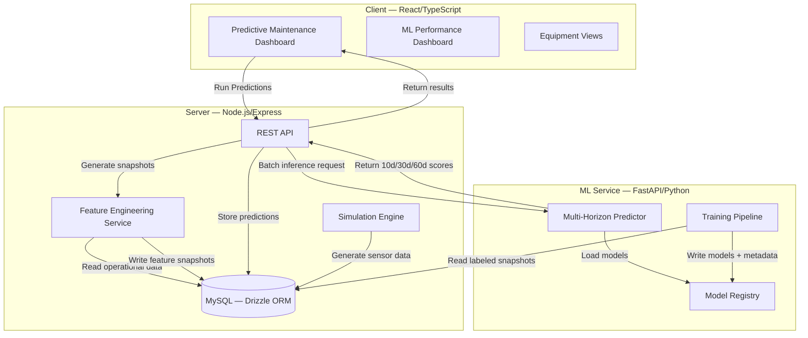

# Enterprise Asset Inventory Management — Architecture

> A full-stack predictive maintenance platform for rental fleet operations.  
> Combines a React/Node.js application with a Python ML service to predict equipment failure across 10, 30, and 60-day horizons.

---

## Table of Contents

1. [Problem Statement](#problem-statement)
2. [System Architecture](#system-architecture)
3. [ML Pipeline](#ml-pipeline)
4. [Feature Engineering](#feature-engineering)
5. [Model Design Decisions](#model-design-decisions)
6. [Model Performance](#model-performance)
7. [Known Limitations & Roadmap](#known-limitations--roadmap)
8. [Tech Stack](#tech-stack)

---

## Problem Statement

Rental fleet operators face two compounding problems:

- **Reactive maintenance** — equipment fails in the field during a rental, damaging the customer relationship and incurring emergency repair costs significantly higher than scheduled maintenance
- **Suboptimal utilization** — without failure probability signals, dispatchers assign equipment based on availability alone, routing borderline units into long-term rentals where a field failure is most costly

Pure preventive maintenance (PM) schedules address the first problem partially but can't inform the second at all. A unit can be within its PM interval and still have a 45% probability of failure in the next 10 days based on its actual wear trajectory.

This system builds toward the optimal intervention point: the moment when expected failure cost exceeds preventive maintenance cost. That calculation requires forward-projected failure probabilities, not just current risk state.

```
Expected failure cost   = P(failure) × (repair cost + downtime cost + customer impact)
Preventive maint. cost  = labor + parts + scheduled downtime

→ Intervene when: Expected failure cost > PM cost
```

---

## System Architecture



### Data Flow — Inference

```
Operational Data (sensor logs, maintenance events, rentals)
    ↓
Feature Engineering Service (Node.js)
    → 31 features extracted per equipment per snapshot
    → Saved to asset_feature_snapshots
    ↓
FastAPI Predictor
    → Loads v1.x models from registry
    → Clips features to training distribution bounds
    → Returns calibrated probabilities for 10d / 30d / 60d
    ↓
Dashboard
    → Risk level classification (LOW / MEDIUM / HIGH)
    → Trend direction (INCREASING / DECREASING / STABLE)
    → Top risk drivers per horizon
```

### Data Flow — Training

```
asset_feature_snapshots (labeled with 10d/30d/60d outcomes)
    ↓
train_model_multihorizon.py
    → TimeSeriesSplit cross-validation (5 folds)
    → Separate Random Forest per horizon
    → CalibratedClassifierCV (sigmoid for 10d, isotonic for 30d/60d)
    ↓
Model Registry
    → rf_{horizon}d_v{version}.pkl
    → feature_importance_{horizon}d_v{version}.json
    → clip_thresholds_v{version}.json
    → feature_cols_v{version}.json
    → metadata_{horizon}d_v{version}.json
```

---

## ML Pipeline

### Simulation Engine

Real-world equipment failure data is rare, imbalanced, and expensive to collect. This project uses a discrete-event simulation engine to generate realistic operational data:

- 15 original equipment items across four age cohorts (purchased 2018-2023), simulated across 2,800+ days (2024-2031)
- Fleet renewal: equipment exceeding 10 years age or 8 years + 8,000 hours is automatically retired and replaced with a new equivalent unit, keeping fleet size and age distribution realistic indefinitely
- Daily sensor readings: vibration, temperature, oil pressure, hydraulic pressure, fuel efficiency
- Maintenance events driven by a Weibull-inspired hazard function — failure probability is a function of age, cumulative hours, and days since last maintenance, not a flat random rate
- Only MAJOR_SERVICE events count as positive labels — routine MINOR_SERVICE and INSPECTION events are excluded from failure prediction targets
- Event type distribution: ~15% MAJOR_SERVICE, ~55% MINOR_SERVICE, ~30% INSPECTION

Fleet renewal produces a cyclical failure rate pattern rather than monotonic saturation: the 2018 cohort peaks at ~35% positive rate in 2027, drops back to ~28% in 2028 when replacements arrive, then ramps gradually again. This gives the model training data across the full equipment lifecycle — infant, mid-life, wear-out, and post-renewal — rather than just the wear-out phase.

### Labeling

Each feature snapshot is labeled with three binary outcomes:

- `will_fail_10d` — did this equipment have a failure event within 10 days of snapshot?
- `will_fail_30d` — within 30 days?
- `will_fail_60d` — within 60 days?

Labels are assigned retrospectively from the maintenance event log. A "failure" is defined as an unscheduled MAJOR_SERVICE event — routine minor service and inspections are explicitly excluded. This distinction is critical: including all maintenance events as positive labels produces positive rates of 60-100% everywhere in the timeline, making the classification problem trivial and the model useless for real prediction.

### Training

Three separate Random Forest classifiers are trained, one per horizon. The key evaluation methodology is **temporal cross-validation** — described in detail in the design decisions section below.

### Inference

The FastAPI predictor loads all three models at startup from the model registry (via glob pattern — no hardcoded version strings). At inference time:

1. Features are clipped to training distribution bounds (prevents extrapolation artifacts)
2. Each model returns a calibrated failure probability
3. Risk level is classified: HIGH ≥ 0.55, MEDIUM ≥ 0.30, LOW < 0.30
4. Risk trend is computed by comparing 10d → 30d → 60d probabilities
5. Top risk drivers are extracted from feature importances

---

## Feature Engineering

38 features extracted per equipment per snapshot, organized into five groups:

### Usage & Lifecycle
| Feature | Description |
|---------|-------------|
| `asset_age_years` | Calendar age of equipment |
| `total_hours_lifetime` | Cumulative operating hours |
| `hours_used_30d` / `hours_used_90d` | Recent usage intensity |
| `rental_days_30d` / `rental_days_90d` | Recent rental activity |
| `avg_rental_duration` | Average rental length |
| `utilization_vs_expected` | Actual vs. expected utilization rate |

### Maintenance History
| Feature | Description |
|---------|-------------|
| `maintenance_events_90d` | Event frequency |
| `maintenance_cost_180d` | Cost trajectory |
| `days_since_last_maintenance` | Recency of last service |
| `mean_time_between_failures` | Historical MTBF |
| `maint_overdue` | Binary flag: past PM interval |
| `cost_per_event` | Average cost per maintenance event |
| `maint_burden` | Maintenance cost as % of asset value |

### Composite Wear Scores
| Feature | Description |
|---------|-------------|
| `wear_rate` | Normalized wear accumulation rate |
| `aging_factor` | Age × usage interaction term |
| `mechanical_wear_score` | Composite mechanical condition indicator |
| `abuse_score` | Overuse / overload signal |
| `neglect_score` | Deferred maintenance signal |

### Contextual Risk
| Feature | Description |
|---------|-------------|
| `vendor_reliability_score` | Historical reliability by manufacturer |
| `jobsite_risk_score` | Operating environment severity |
| `usage_intensity` | Intensity relative to equipment class norm |
| `usage_trend` | Trend in usage over recent periods |

### Velocity Features (v1.6+)
Rate-of-change features that capture deterioration trajectory — critical for distinguishing equipment that looks borderline today but is deteriorating rapidly from equipment that has plateaued.

| Feature | Description |
|---------|-------------|
| `wear_rate_velocity` | Rate of change in wear accumulation |
| `maint_frequency_trend` | Acceleration in maintenance frequency |
| `cost_trend` | Trend in maintenance cost per period |
| `hours_velocity` | Rate of change in operating hours |
| `neglect_acceleration` | Worsening of deferred maintenance |
| `sensor_degradation_rate` | Rate of sensor reading deterioration |

---

## Model Design Decisions

### Decision 1 — TimeSeriesSplit over random train/test split

**Problem:** Random train/test splits leak future information into training when data is temporal. A model trained on a random 80% sample of time-series data has seen future snapshots during training — its test performance will be optimistically biased.

**What we do:** `sklearn.model_selection.TimeSeriesSplit` with 5 folds and a gap equal to the horizon length. Each fold trains on past data only and validates on the immediately following window. The gap prevents label leakage across the horizon boundary.

**Why it matters for this dataset specifically:** The simulation produces a temporal distribution shift — positive rates increase from ~26% in early data to ~70% in recent data as equipment ages. A single 80/20 temporal holdout exposes the model to this worst-case shift in evaluation. TimeSeriesSplit averages performance across five different time windows, giving a more representative estimate of how the model will perform in deployment.

```
Fold 1: [──train──]                    [val]
Fold 2: [────train────]           [val]
Fold 3: [──────train──────]  [val]
Fold 4: [────────train────────][val]
Fold 5: [──────────train──────────][val]
         ← gap = horizon_days →
```

**Alternative considered:** Oversampling the training set to match test distribution. Rejected because it works backwards — tuning training to match test set is a form of test set leakage and signals poor evaluation methodology to a technical reviewer.

### Decision 2 — Three separate models, not one multi-output model

**Problem:** A single multi-output classifier trained to predict 10d/30d/60d simultaneously must learn one feature representation that serves all three tasks. But the features most predictive of imminent failure (10d) differ meaningfully from those predictive of long-horizon failure (60d).

**What we do:** Train three independent Random Forest classifiers. Each learns its own feature importance ranking and its own decision boundaries.

**Evidence from feature importances:** The 30d and 60d models weight composite wear scores and lifecycle features heavily. The 10d model weights recent sensor readings and velocity features more heavily — exactly what you'd expect from domain knowledge about failure precursors.

### Decision 3 — Sigmoid calibration for 10d, isotonic for 30d/60d

**Problem:** Random Forests output well-ranked probabilities but poorly calibrated ones — the scores are good for ordering risk but not for interpreting as true probabilities. Calibration corrects this. Two methods are available: sigmoid (Platt scaling) and isotonic regression.

**What we do:** 10d uses sigmoid calibration, 30d and 60d use isotonic.

**Rationale:** Isotonic calibration is a non-parametric monotonic function fit — it's more flexible but requires more data and can overfit when the calibration set has a skewed or unrepresentative class distribution. The 10d model's training data has significant positive rate variation across folds (26% early → 70% late), making the calibration set systematically different from the training distribution. Sigmoid calibration is more constrained and generalizes better under this condition. The 30d and 60d models have more stable distributions and larger effective calibration sets, making isotonic appropriate.

### Decision 4 — Velocity features as first-class inputs

**Problem:** Static feature snapshots capture current state but not trajectory. Two units with identical wear scores may have very different failure probabilities if one is deteriorating rapidly and the other has plateaued.

**What we do:** Six velocity features computed from rolling windows of historical snapshots. These are rate-of-change signals, not levels.

**Impact (v1.12):** `wear_rate_velocity` is now the 2nd most important feature in the 10d model (16.3%) and 4th in 30d/60d (~13-14%). The 60d holdout ROC-AUC jumped from 0.879 to 0.922 when velocity features started contributing — longer-horizon prediction benefits most from trajectory information because a unit's current state is less predictive of failure 60 days out than whether its wear is accelerating.

**Implementation note:** The velocity features were computed correctly from v1.6 onward but were hardcoded to default values (0 and 1.0) in the snapshot save function due to a bug in `feature-engineering.ts`. Fixed in the v1.12 cycle — the save function now reads computed values from the enhanced feature service.

### Decision 5 — Model registry with glob-based version resolution

**Problem:** Hardcoded model version strings in inference code create deployment friction and make version rollback error-prone.

**What we do:** The predictor loads models at startup by globbing the registry directory for the latest version matching `rf_{horizon}d_*.pkl`. No version string appears in inference code. Rollback is handled by removing a file, not by changing code.

### Decision 6 — Log-transform skewed features and drop raw versions

**Problem:** Maintenance cost and hours features are heavily right-skewed — a small number of major repair events produce extreme values that distort tree split decisions. Including both raw and log-transformed versions of the same feature causes double-counting: the model allocates importance to two representations of the same signal, crowding out other features.

**What we do:** Log-transform seven skewed features using `np.log1p` (handles zeros cleanly), then drop the raw versions. Only the log-transformed columns enter the model.

**Impact:** Removing the raw versions in v1.10 reduced the feature count from 38 to 31 and allowed `log_maintenance_cost_180d` to emerge clearly as the second most important feature across all three horizons.

---

## Model Performance

### v1.12 Results — Current Production Models

| Horizon | CV ROC-AUC (mean ± std) | Holdout ROC-AUC | Holdout PR-AUC | FNR | Calibration |
|---------|------------------------|-----------------|----------------|-----|-------------|
| 10d | 0.9866 ± 0.0076 | 0.9743 | 0.9552 | 7.6% | Sigmoid |
| 30d | 0.9842 ± 0.0103 | 0.9472 | 0.9356 | 18.6% | Isotonic |
| 60d | 0.9853 ± 0.0082 | 0.9223 | 0.9164 | 29.0% | Isotonic |

**Training data:** 20,900 labeled snapshots · 31 features · 2024-2031 simulation period  
**Positive rates:** 10d=19.7%, 30d=23.9%, 60d=27.3%

### CV Fold Stability — v1.12

```
10d Folds:  0.9743 → 0.9833 → 0.9870 → 0.9965 → 0.9918  (std: 0.0076 ✅)
30d Folds:  0.9685 → 0.9772 → 0.9906 → 0.9979 → 0.9867  (std: 0.0103 ✅)
60d Folds:  0.9759 → 0.9841 → 0.9973 → 0.9915 → 0.9774  (std: 0.0082 ✅)
```

### Top Feature Importances — v1.12

| Rank | 10d Model | 30d Model | 60d Model |
|------|-----------|-----------|-----------|
| 1 | asset_age_years (22%) | asset_age_years (20%) | asset_age_years (20%) |
| 2 | wear_rate_velocity (16%) | log_total_hours_lifetime (15%) | log_maintenance_cost_180d (16%) |
| 3 | log_total_hours_lifetime (16%) | log_maintenance_cost_180d (14%) | log_total_hours_lifetime (15%) |
| 4 | log_maintenance_cost_180d (15%) | wear_rate_velocity (14%) | wear_rate_velocity (13%) |
| 5 | maint_frequency_trend (10%) | log_mean_time_between_failures (14%) | log_mean_time_between_failures (11%) |

`wear_rate_velocity` appearing in the top 5 across all three horizons is the key improvement in v1.12 — the model now distinguishes between equipment at the same current state but on different deterioration trajectories.

### Version Progression

| Version | Key Change | 10d CV AUC | 30d CV AUC | 60d CV AUC | Max Fold Std | Samples |
|---------|-----------|-----------|-----------|-----------|-------------|---------|
| v1.8 | TimeSeriesSplit introduced | 0.709 | 0.704 | 0.591 | 0.318 ⚠️ | 12,620 |
| v1.9 | Fixed labeling + hazard curve | 0.873 | 0.831 | 0.786 | 0.056 ✅ | 1,320 |
| v1.10 | Removed feature double-counting | 0.877 | 0.824 | 0.780 | 0.047 ✅ | 1,395 |
| v1.11 | Fleet renewal + 12x data | 0.986 | 0.984 | 0.979 | 0.016 ✅ | 17,235 |
| **v1.12** | **Velocity features live** | **0.987** | **0.984** | **0.985** | **0.010 ✅** | **20,900** |

† v1.6 holdout metrics were inflated by a simulation cliff artifact — not comparable to CV metrics

### Interpreting the Results

**Distribution shift is resolved.** Dev and holdout positive rates are now within 6-14 points of each other (was 27+ points in v1.10) because fleet renewal keeps the failure rate stable across the full simulation timeline. The holdout no longer represents an extreme aged-fleet scenario.

**FNR increases with horizon**, which is expected and correct: the 10d model misses 7.6% of failures (high precision short-horizon prediction), while the 60d model misses 29% (harder to predict 2 months out). In the rental routing use case the 10d model is most operationally critical — a 7.6% miss rate means 1 in 13 genuine failure warnings goes undetected.

---

## Known Limitations & Roadmap

### Current Limitations

**1. Risk stratification, not remaining useful life**
The system currently outputs current-state failure probability. It does not project the probability trajectory forward or estimate when a unit will cross a risk threshold. This limits the actionability of the output — a dispatcher seeing "HIGH risk" doesn't know whether that means "fail tomorrow" or "fail in 8 days."

**2. No cost model**
The optimal intervention point requires estimating expected failure cost vs. PM cost. The formula is implemented conceptually but no cost inputs exist in the schema. `daily_rate` is available as a proxy for downtime cost.

**3. Rental workflow integration**
Risk scores are generated on demand but are not surfaced at the point of rental creation. A dispatcher assigning equipment to a 3-week rental receives no warning if the unit has elevated 10d failure probability. The signal exists but is disconnected from the workflow where it creates value.

**4. Simulated data**
All training data is generated by a discrete-event simulation. The model has never seen real sensor readings, real maintenance patterns, or real failure modes. Feature distributions, failure rates, and wear trajectories are plausible but synthetic.

**5. 60d FNR**
The 60d model misses 29% of failures — roughly 1 in 3 genuine long-horizon warnings goes undetected. This is inherent to the prediction difficulty at 60 days and will improve incrementally with more training data and potentially additional features.

### Roadmap

| Track | Description | Status |
|-------|-------------|--------|
| Track A | Snapshot date bug fix | ✅ Complete |
| Track B | Velocity feature engineering | ✅ Complete |
| Track C | Pipeline status, feature importance, query cache | ✅ Complete |
| Track D | Fleet renewal simulation + v1.11/v1.12 training | ✅ Complete |
| Track E | Forward projection — trajectory endpoint, probability curves per unit | 📋 Next |
| Track F | Cost model — optimal intervention point calculation | 📋 Planned |
| Track G | Rental assignment guard — risk warning at dispatch | 📋 Planned |
| Track H | RUL display — estimated days to HIGH threshold | 📋 Planned |

---

## Tech Stack

| Layer | Technology | Notes |
|-------|-----------|-------|
| Frontend | React 18, TypeScript, TanStack Query, Tailwind CSS, shadcn/ui | |
| Backend | Node.js, Express, Drizzle ORM | Port 5000 |
| ML Service | Python, FastAPI, scikit-learn, pandas, SQLAlchemy | Port 8000 |
| Database | MySQL 8.0 | |
| Models | Random Forest (scikit-learn), CalibratedClassifierCV | 3 models × version |
| Simulation | Custom discrete-event engine with Weibull hazard function + fleet renewal | 2,800+ simulated days |
| Model Registry | File system (pkl + json) | Glob-based version resolution |

---

*Last updated: v1.12 — current production models*
*Model registry: `ml-service/registry/`*
*Training script: `ml-service/training/train_model_multihorizon.py`*