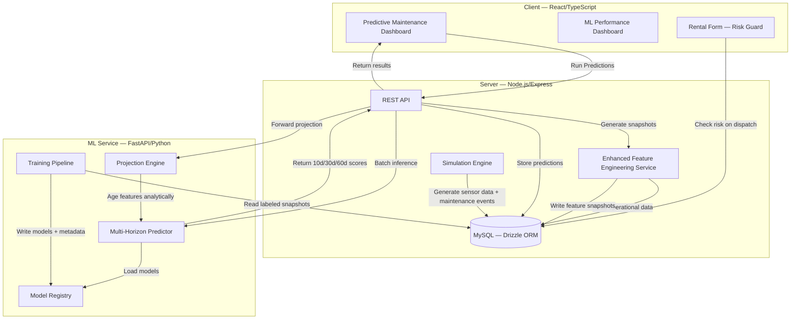

# Enterprise Asset Inventory Management — Architecture

> A full-stack predictive maintenance platform for rental fleet operations.  
> Combines a React/Node.js application with a Python ML service to predict equipment failure across 10, 30, and 60-day horizons — with forward trajectory projection, cost-optimized intervention recommendations, and a rental dispatch risk guard.

---

## Table of Contents

1. [Problem Statement](#problem-statement)
2. [System Architecture](#system-architecture)
3. [ML Pipeline](#ml-pipeline)
4. [Feature Engineering](#feature-engineering)
5. [Model Design Decisions](#model-design-decisions)
6. [Model Performance](#model-performance)
7. [Completed Feature Tracks](#completed-feature-tracks)
8. [Known Limitations](#known-limitations)
9. [Tech Stack](#tech-stack)

---

## Problem Statement

Rental fleet operators face two compounding problems:

- **Reactive maintenance** — equipment fails in the field during a rental, damaging the customer relationship and incurring emergency repair costs significantly higher than scheduled maintenance
- **Suboptimal dispatch** — without failure probability signals, dispatchers assign equipment based on availability alone, routing borderline units into long-term rentals where a field failure is most costly

Pure preventive maintenance schedules address the first problem partially but cannot inform the second at all. A unit can be within its PM interval and still have a 45% probability of failure in the next 10 days based on its actual wear trajectory.

This system builds toward the optimal intervention point: the moment when expected failure cost exceeds preventive maintenance cost. That calculation requires forward-projected failure probabilities, not just current risk state.

```
Expected failure cost   = P(failure) × (repair cost + downtime cost + customer impact)
Preventive maint. cost  = labor + parts + scheduled downtime

→ Intervene when: Expected failure cost > PM cost
```

---

## System Architecture



### Data Flow — Inference

```
Operational Data (sensor logs, maintenance events, rentals)
    ↓
Enhanced Feature Engineering Service (Node.js)
    → 31 features extracted per equipment per snapshot date
    → Derived features recomputed fresh at inference (not stored)
    → Saved to asset_feature_snapshots
    ↓
FastAPI Multi-Horizon Predictor
    → Loads latest v1.x models from registry (glob-based, no hardcoded versions)
    → Clips features to training distribution bounds
    → Returns calibrated probabilities for 10d / 30d / 60d
    ↓
Dashboard
    → Risk level classification (HIGH ≥ 0.60, MEDIUM ≥ 0.30, LOW < 0.30)
    → Trend direction (INCREASING / DECREASING / STABLE)
    → Top risk drivers per horizon
    → 60-day trajectory curve (projection engine)
    → Optimal PM intervention day (cost model)
```

### Data Flow — Training

```
asset_feature_snapshots (labeled with 10d/30d/60d outcomes)
    ↓
train_model_multihorizon.py
    → TimeSeriesSplit CV (5 folds, gap = horizon days)
    → Separate Random Forest per horizon
    → CalibratedClassifierCV (sigmoid for 10d, isotonic for 30d/60d)
    → Log-transform 7 skewed features, drop raw versions (38 → 31 features)
    ↓
Model Registry
    → rf_{horizon}d_v{version}.pkl
    → feature_importance_{horizon}d_v{version}.json
    → clip_thresholds_v{version}.json
    → feature_cols_v{version}.json
    → metadata_{horizon}d_v{version}.json
    → label_encoder_category_v{version}.pkl
```

---

## ML Pipeline

### Simulation Engine

Real-world equipment failure data is rare, imbalanced, and expensive to collect. This project uses a discrete-event simulation engine to generate realistic operational data:

- 15 original equipment items across four age cohorts (purchased 2018–2023), simulated across 2,900+ days (2024–2032)
- **Fleet renewal** — equipment exceeding 10 years age, or 8 years + 8,000 hours, is automatically retired and replaced with a new equivalent unit (`EQ-R{id}-{year}` naming), keeping fleet size and age distribution realistic indefinitely
- Daily sensor readings generated per unit: vibration XYZ, engine temp, oil pressure, hydraulic pressure, fuel consumption, RPM
- Maintenance events fired probabilistically via a **Weibull-inspired hazard function** — failure probability is a function of age, cumulative hours, and days since last maintenance, not a flat random rate
- Event type distribution: ~15% MAJOR_SERVICE, ~55% MINOR_SERVICE, ~30% INSPECTION
- Only MAJOR_SERVICE events count as positive labels — routine minor service and inspections are excluded from failure prediction targets

Fleet renewal produces a cyclical failure rate pattern rather than monotonic saturation: the 2018 cohort peaks at ~35% positive rate in 2027, drops back to ~28% in 2028 when replacements arrive, then ramps gradually again. This gives the model training data across the full equipment lifecycle — infant, mid-life, wear-out, and post-renewal — rather than just the wear-out phase.

### Labeling

Each feature snapshot is labeled with three binary outcomes:

- `will_fail_10d` — did this equipment have a MAJOR_SERVICE event within 10 days of snapshot?
- `will_fail_30d` — within 30 days?
- `will_fail_60d` — within 60 days?

Labels are assigned retrospectively from the maintenance event log. A "failure" is defined as an unscheduled MAJOR_SERVICE event — routine minor service and inspections are explicitly excluded. This distinction is critical: including all maintenance events as positive labels produces positive rates of 60–100% everywhere in the timeline, making the classification problem trivial and the model useless for real prediction.

### Training

Three separate Random Forest classifiers are trained, one per horizon, using temporal cross-validation. The training script (`train_model_multihorizon.py`) is triggerable from the admin UI — it runs as a background subprocess, streams output to a live log drawer, and hot-swaps the loaded models in FastAPI on completion.

Version is auto-incremented from the last DB record. No version string appears in inference code.

### Inference

The FastAPI predictor loads all three models at startup from the model registry via glob pattern. At inference time:

1. Features are clipped to training distribution bounds (prevents extrapolation artifacts)
2. Each model returns a calibrated failure probability
3. Risk level classified: HIGH ≥ 0.60, MEDIUM ≥ 0.30, LOW < 0.30
4. Risk trend computed by comparing 10d → 30d → 60d probabilities
5. Top risk drivers extracted from feature importances

### Forward Projection

The projection engine (`projector.py`) ages features analytically in 7-day steps over a 60-day window, running `predict_multi_horizon` at each step:

- `days_since_last_maintenance` increments by step size
- `asset_age_years` and `total_hours_lifetime` age proportionally
- `neglect_score` and `neglect_acceleration` compound over time
- All other features held constant (conservative — assumes no maintenance occurs)

Returns a `curve` of `{day, 10d, 30d, 60d}` points, `threshold_crossings` (first day each horizon crosses HIGH), and `days_until_high` (earliest crossing across all horizons).

### Cost Model

The cost model (`client/src/lib/cost-model.ts`) identifies the optimal PM intervention day:

```
failure_cost = daily_rate × FAILURE_DOWNTIME_DAYS (7)
pm_cost      = category-specific estimate ($400–$1,200)

optimal_day  = first projection curve day where P(60d) × failure_cost > pm_cost
savings      = failure_cost_at_optimal_day - pm_cost
```

`daily_rate` is read from the equipment schema. PM cost is estimated by category from industry averages. The result is surfaced per-asset in the prediction modal as a plain-English callout.

---

## Feature Engineering

31 features after log-transform and raw-drop, organized into five groups:

### Usage & Lifecycle
| Feature | Description |
|---------|-------------|
| `asset_age_years` | Calendar age of equipment |
| `log_total_hours_lifetime` | Log cumulative operating hours |
| `log_hours_used_30d` / `log_hours_used_90d` | Log recent usage intensity |
| `rental_days_30d` / `rental_days_90d` | Recent rental activity |
| `avg_rental_duration` | Average rental length |
| `utilization_vs_expected` | Actual vs. expected utilization rate |

### Maintenance History
| Feature | Description |
|---------|-------------|
| `maintenance_events_90d` | Event frequency |
| `log_maintenance_cost_180d` | Log cost trajectory |
| `days_since_last_maintenance` | Recency of last service |
| `log_mean_time_between_failures` | Log historical MTBF |
| `maint_overdue` | Binary flag: past PM interval |
| `log_cost_per_event` | Log average cost per maintenance event |
| `log_maint_burden` | Log maintenance cost as % of asset value |

### Composite Wear Scores
| Feature | Description |
|---------|-------------|
| `wear_rate` | Normalized wear accumulation rate |
| `aging_factor` | Age × usage interaction term |
| `mechanical_wear_score` | Composite mechanical condition indicator |
| `abuse_score` | Overuse / overload signal |
| `neglect_score` | Deferred maintenance signal |

### Contextual Risk
| Feature | Description |
|---------|-------------|
| `vendor_reliability_score` | Historical reliability by manufacturer |
| `jobsite_risk_score` | Operating environment severity |
| `usage_intensity` | Intensity relative to equipment class norm |
| `usage_trend` | Trend in usage over recent periods |
| `category_encoded` | Label-encoded equipment category |

### Velocity Features
Rate-of-change features that capture deterioration trajectory — critical for distinguishing equipment that looks borderline today but is deteriorating rapidly from equipment that has plateaued.

| Feature | Description |
|---------|-------------|
| `wear_rate_velocity` | Rate of change in wear accumulation |
| `maint_frequency_trend` | Acceleration in maintenance frequency |
| `cost_trend` | Trend in maintenance cost per period |
| `hours_velocity` | Rate of change in operating hours |
| `neglect_acceleration` | Worsening of deferred maintenance |
| `sensor_degradation_rate` | Rate of sensor reading deterioration |

**Implementation note:** Derived columns (aging_factor, wear_rate, mechanical_wear_score, etc.) are NOT stored in `asset_feature_snapshots` — they are recomputed fresh at inference time by `enhancedFeatureService.generateSnapshot()`. This prevents staleness from schema drift and keeps the feature pipeline as the single source of truth.

---

## Model Design Decisions

### Decision 1 — TimeSeriesSplit over random train/test split

**Problem:** Random train/test splits leak future information into training when data is temporal. A model trained on a random 80% sample of time-series data has seen future snapshots during training — its test performance will be optimistically biased.

**What we do:** `sklearn.model_selection.TimeSeriesSplit` with 5 folds and a gap equal to the horizon length. Each fold trains on past data only and validates on the immediately following window. The gap prevents label leakage across the horizon boundary.

```
Fold 1: [──train──]                    [val]
Fold 2: [────train────]           [val]
Fold 3: [──────train──────]  [val]
Fold 4: [────────train────────][val]
Fold 5: [──────────train──────────][val]
         ← gap = horizon_days →
```

### Decision 2 — Three separate models, not one multi-output model

**Problem:** A single multi-output classifier must learn one feature representation that serves all three tasks. But features most predictive of imminent failure (10d) differ meaningfully from those predictive of long-horizon failure (60d).

**Evidence from feature importances:** The 10d model weights `wear_rate_velocity` as the #2 feature (16%). The 60d model weights `log_maintenance_cost_180d` as #2 (17%) — a slower-moving signal. Separate models allow each horizon to learn its own optimal weighting.

### Decision 3 — Sigmoid calibration for 10d, isotonic for 30d/60d

Random Forests output well-ranked but poorly calibrated probabilities. `CalibratedClassifierCV` corrects this.

**Rationale:** Isotonic calibration is flexible but can overfit when the calibration set has a skewed class distribution. The 10d model's training data has significant positive rate variation across folds (10–28%), making the calibration set systematically different from training. Sigmoid is more constrained and generalizes better under this condition. The 30d/60d models have more stable distributions and larger effective calibration sets, making isotonic appropriate.

### Decision 4 — Velocity features as first-class inputs

Static feature snapshots capture current state but not trajectory. Two units with identical wear scores may have very different failure probabilities if one is deteriorating rapidly and the other has plateaued.

**Impact:** `wear_rate_velocity` is the #2 feature in the 10d model (16%) and #3–4 in 30d/60d (~11–14%). The 60d holdout ROC-AUC improved significantly when velocity features started contributing correctly — longer-horizon prediction benefits most from trajectory information because current state is less predictive of failure 60 days out than whether wear is accelerating.

**Bug fixed in v1.12 cycle:** Velocity features were being hardcoded to defaults (0 and 1.0) in the snapshot save function due to a missing call to `enhancedFeatureService.generateSnapshot()` in `generateSnapshotsForAllEquipment`. Fixed — the save function now reads computed values from the enhanced service.

### Decision 5 — Log-transform skewed features and drop raw versions

Maintenance cost and hours features are heavily right-skewed. Including both raw and log-transformed versions causes double-counting — the model allocates importance to two representations of the same signal, crowding out other features.

**What we do:** Log-transform 7 skewed features using `np.log1p` (handles zeros cleanly), then drop the raw versions. 38 features → 31 features. This allowed `log_maintenance_cost_180d` to emerge clearly as the 2nd most important feature across 30d/60d horizons.

### Decision 6 — Glob-based version resolution, no hardcoded version strings

The predictor loads models at startup by globbing the registry for the latest version matching `rf_{horizon}d_*.pkl`. Numeric version sorting is applied (`v1.9 < v1.12`, not string sort). No version string appears in inference code — rollback is handled by removing a file, not by changing code.

---

## Model Performance

### v1.14 — Current Production Models

**Training data:** 22,025 labeled snapshots · 31 features · 2024–2032 simulation timeline  
**Positive rates:** 10d=19.8%, 30d=24.0%, 60d=27.6%

| Horizon | CV ROC-AUC | Holdout ROC-AUC | PR-AUC | Recall (failure) | FNR | Calibration |
|---------|-----------|----------------|--------|-----------------|-----|-------------|
| 10d | 0.9871 ± 0.0050 | 0.9672 | 0.9383 | 92.5% | 7.5% | Sigmoid |
| 30d | 0.9853 ± 0.0090 | 0.9297 | 0.9210 | 81.7% | 18.3% | Isotonic |
| 60d | 0.9815 ± 0.0147 | 0.8821 | 0.8826 | 71.0% | 29.0% | Isotonic |

**Why holdout AUC drops across horizons:** The 60d holdout set has a 37% positive rate vs 25% in dev — the aging fleet distribution shifts significantly over time. CV ROC-AUC is the more representative performance estimate for deployment.

**FNR increases with horizon** — expected and correct. The 10d model misses 7.5% of failures. In the rental routing use case this is most operationally critical — a 7.5% miss rate means roughly 1 in 13 genuine near-term failure warnings goes undetected.

### Top Feature Importances — v1.14

| Rank | 10d Model | 30d Model | 60d Model |
|------|-----------|-----------|-----------|
| 1 | asset_age_years (21%) | asset_age_years (21%) | asset_age_years (23%) |
| 2 | log_mean_time_between_failures (16%) | log_maintenance_cost_180d (16%) | log_maintenance_cost_180d (17%) |
| 3 | wear_rate_velocity (15%) | wear_rate_velocity (14%) | log_total_hours_lifetime (15%) |
| 4 | log_total_hours_lifetime (14%) | log_total_hours_lifetime (12%) | vendor_reliability_score (12%) |
| 5 | log_maintenance_cost_180d (13%) | log_mean_time_between_failures (12%) | wear_rate_velocity (11%) |

### Version Progression

| Version | Key Change | 10d CV AUC | 30d CV AUC | 60d CV AUC | Samples |
|---------|-----------|-----------|-----------|-----------|---------|
| v1.8 | TimeSeriesSplit introduced | 0.709 | 0.704 | 0.591 | 12,620 |
| v1.9 | Fixed labeling + hazard curve | 0.873 | 0.831 | 0.786 | 1,320 |
| v1.10 | Removed feature double-counting | 0.877 | 0.824 | 0.780 | 1,395 |
| v1.11 | Fleet renewal + 12× data | 0.986 | 0.984 | 0.979 | 17,235 |
| v1.12 | Velocity features live | 0.987 | 0.984 | 0.985 | 20,900 |
| v1.13 | 2032 data + UI retrain pipeline | 0.987 | 0.985 | 0.982 | 22,025 |
| **v1.14** | **Production (UI retrain verified)** | **0.987** | **0.985** | **0.982** | **22,025** |

---

## Completed Feature Tracks

| Track | Description | Status |
|-------|-------------|--------|
| A | Snapshot date bug fix | ✅ Complete |
| B | Velocity feature engineering (6 features) | ✅ Complete |
| C | Pipeline status, feature importance, query cache | ✅ Complete |
| D | Fleet renewal simulation + v1.12 training | ✅ Complete |
| E | Forward projection — 60-day trajectory curve, threshold crossing detection | ✅ Complete |
| F | Cost model — optimal PM intervention day, expected savings callout | ✅ Complete |
| G | Rental dispatch guard — HIGH risk blocks dispatch, MEDIUM advisory | ✅ Complete |
| H | RUL display — days to HIGH threshold in prediction modal | ✅ Complete (via sparkline pill) |
| — | Admin retrain pipeline — UI-triggered training with live log stream | ✅ Complete |

---

## Known Limitations

**1. Simulated data only**
All training data is generated by a discrete-event simulation. The model has never seen real sensor readings, real maintenance patterns, or real failure modes. Feature distributions, failure rates, and wear trajectories are plausible but synthetic. Real-world deployment would require retraining on actual fleet data.

**2. 60d FNR**
The 60d model misses 29% of failures — roughly 1 in 3 genuine long-horizon warnings goes undetected. This is inherent to prediction difficulty at 60 days and will improve with more training data and additional leading indicator features.

**3. Projection assumes no maintenance**
The forward projection engine holds maintenance constant — it does not model scheduled PM events in the projection window. This makes projections conservative (pessimistic) for well-maintained equipment, which is correct for worst-case dispatch planning but may overstate risk for equipment with known upcoming service.

**4. simulate/day cap**
The `days` parameter in `POST /api/simulate/day` is capped at 30 regardless of the slider value. Cosmetic bug — does not affect data quality, only throughput of the simulation step.

**5. Model version display**
The `modelStatus` field in `/api/ml/pipeline-status` uses alphabetic sort on registry filenames (`v1.9 > v1.12` alphabetically). Cosmetic — the predictor itself uses correct numeric version sorting. Fixed in the next maintenance cycle.

---

## Tech Stack

| Layer | Technology | Notes |
|-------|-----------|-------|
| Frontend | React 18, TypeScript, TanStack Query, Tailwind CSS, shadcn/ui, Recharts | Vite dev server, port 5173 |
| Backend | Node.js, Express, Drizzle ORM | Port 5000 |
| ML Service | Python 3.12, FastAPI, scikit-learn, pandas, SQLAlchemy | Port 8000 |
| Database | MySQL 8.0 | |
| Models | Random Forest (scikit-learn), CalibratedClassifierCV | 3 models × version in registry |
| Simulation | Custom discrete-event engine, Weibull hazard function, fleet renewal | 2,900+ simulated days (2024–2032) |
| Model Registry | Filesystem (pkl + json), glob-based version resolution | `ml-service/registry/` |
| LLM | Groq (llama3-8b-8192) | Maintenance recommendations |

---

*Last updated: v1.14 — current production models*  
*Training script: `ml-service/training/train_model_multihorizon.py`*  
*Model registry: `ml-service/registry/`*